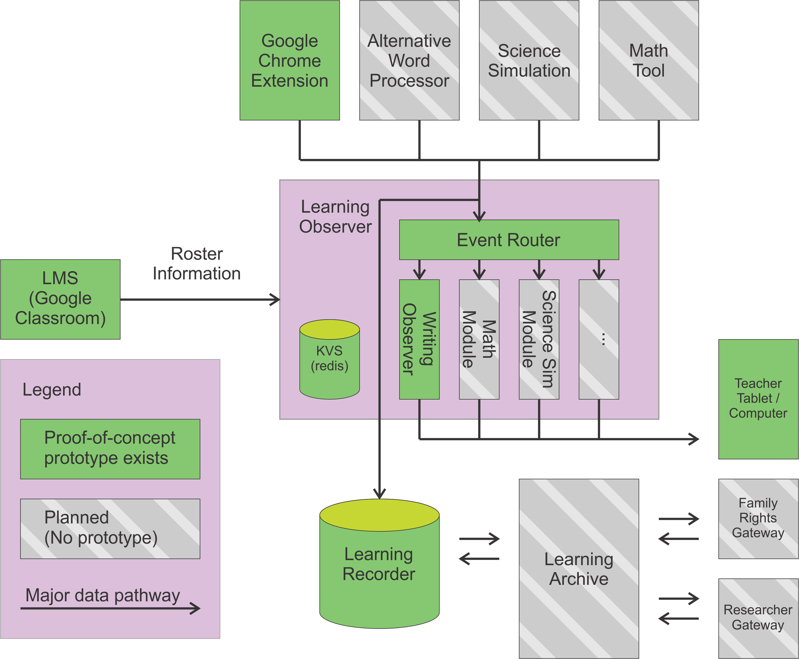
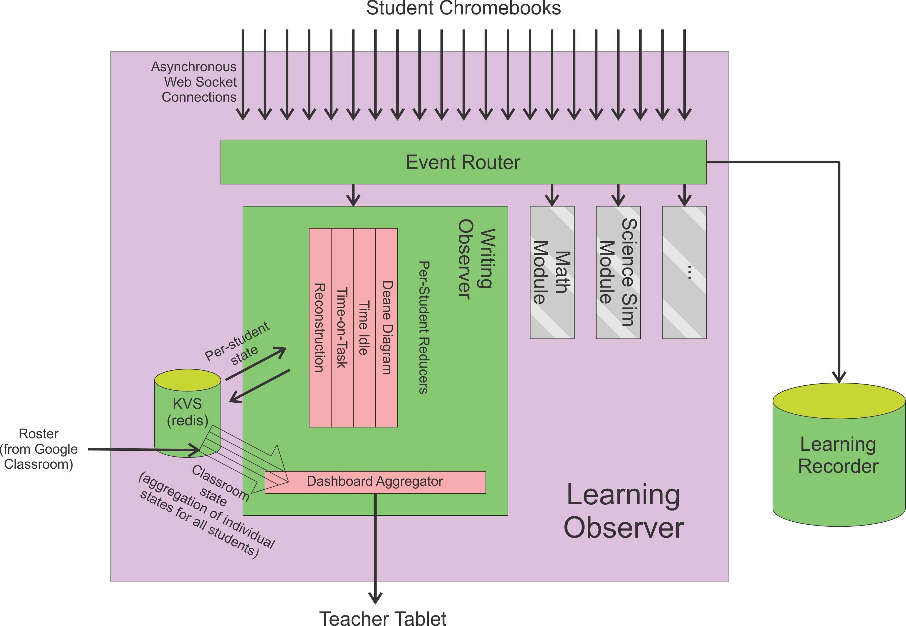
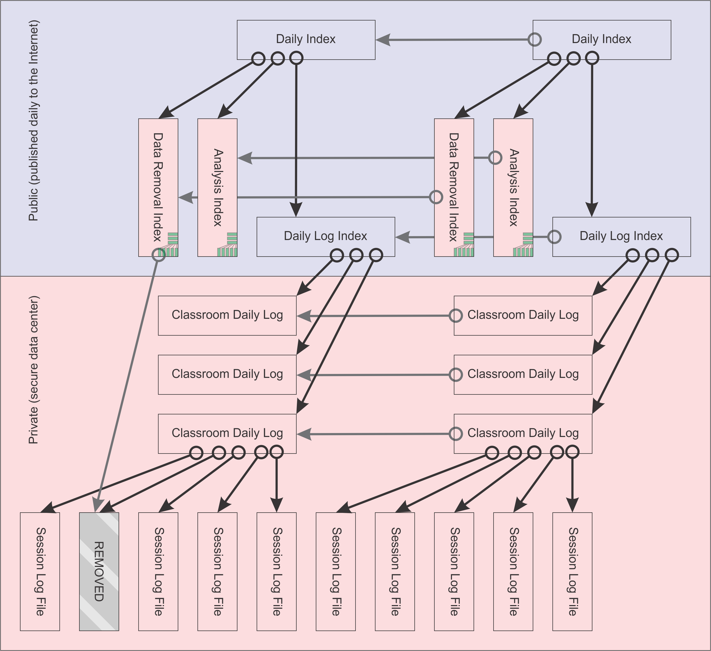

Learning Observer System Design
-------------------------------

Piotr Mitros. 2021-07-11

This lays out the system design, as planned. This design does not
fully reflect the current implementation, yet.

Our goal is to build a system which will:

* Take in process data from a diversity of sources

* Perform real-time processing on that data, in order to support
  teachers in real-time. This is done through a series of pluggable
  analytics modules.

* Archive that data for research purposes and archival analysis

* Provide open science tools to log such analyses

In other words:

Internally, the system takes a stream of events from each learner, and
routes it to one or more analytics modules. Each of these modules
performs a `reduce` operation over that stream in realtime. The
reduced state is stored in a KVS (currently `redis`, although this is
pluggable). These modules run as asynchronous Python co-routines,
which makes them quite scalable. We ought to be able to handle large
numbers of simultanious connections.

Each time an instructor connects, periodically, such data is
aggregated from redis, and sent back to the instructor. This would be
a logical place to be more clever about scaling; ideally, we'd cycle
through instructors for such an aggregation, and only aggregate where
data has changed, so that with large numbers of instructors, the
system merely updates dashboards less quickly:

Although at present, reduce operations are per-student, and
aggregations per-class, in the future, we envision:

* Other ways to shard (e.g. per-resource, per-document, etc.).
* Being able to cascade events, either by generating new events, or in
  much the same way as we handle the current aggregation
* Potentially, being more clever about routing the same student to a
  common process each time. Right now, we're connected per-session,
  but we may have concurrency issues if a student connects twice.

Data will be stored in a git-like Merkle tree format: 

We'll document this in more detail later.