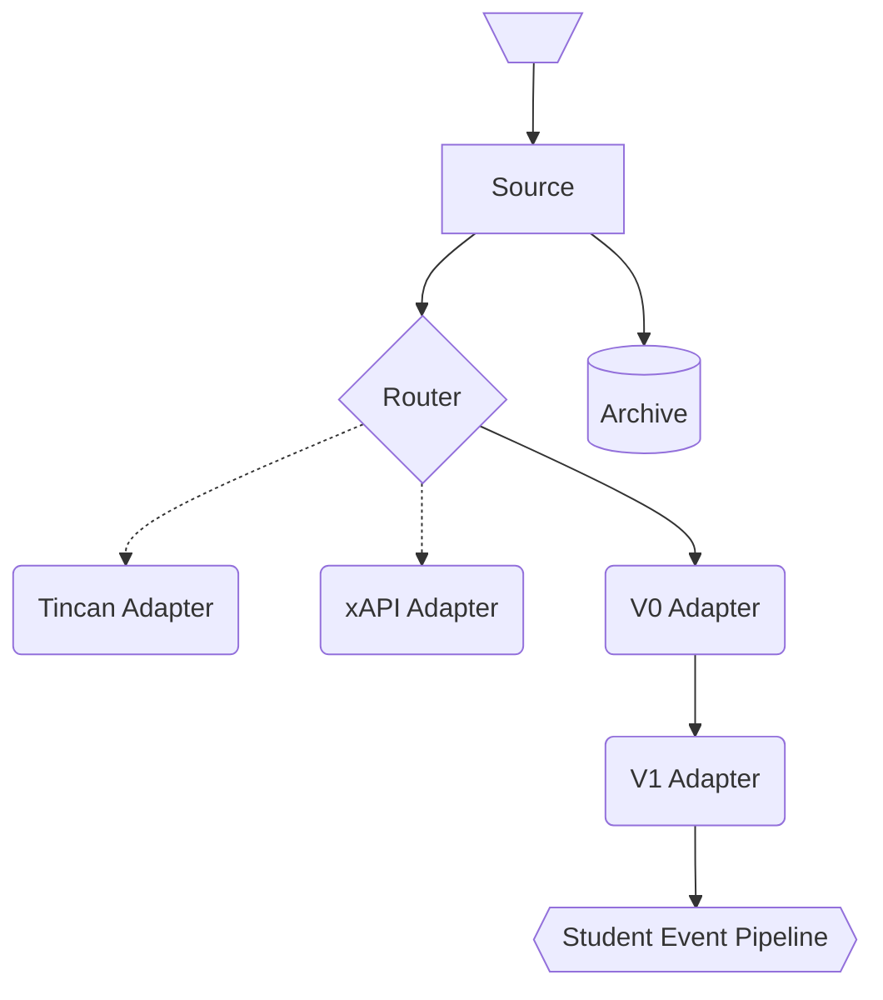

Format Adapters
===============

We would like to be able to take in data from a diversity of formats, such as:

* IMS Caliper
* TinCan/xAPI
* edX events
* Writing Observer
* Various sorts of ad-hoc formats

In addition, we would like to be transparently backwards-compatible with
older versions of formats.

We don't yet know the best way to architect this, but on a high level, this
directory is where we'll put in adapters. Our goal is to have something along
the lines of:

Our goal is to have source events archived in the source format, so as not to
lose information. However, individual reducers and event pipelines should not
be responsible for maintaining backwards-compatibility.

Experiences / thoughts:

* The majority of changes are minor. For example, in an early version of this
  system, we had inconsistent use of dashes versus underscores. Eventually,
  we'd like to adopt more terminology from formats like Tincan and xAPI. In
  Open edX, there was an early breaking change due to a timestamp format
  issue. These sorts of changes are best handled transparently.
* In most cases, aside from a small number of high-level features (such as
  time-on-task or event count), most analytics need to be customized to each
  source. However, it's still helpful to use common formats and terminology
  where convenient.
* We'd like some kind of explicit versioning. How we do that is TBD.
* It's nice if old events just work. The migrations can stick around. Ideally,
  they'll only run on old events, so as not to impact performance.
* We'll need migrations on other parts of the system too (e.g. reduced data
  in the KVS, etc.). That's TBD.