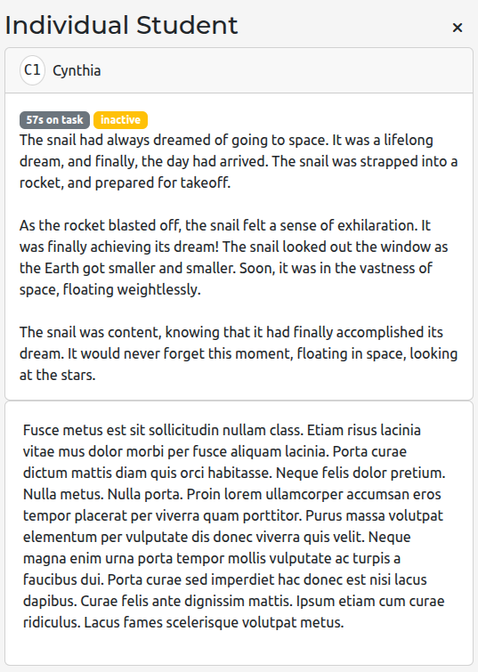

# Writing Observer - Classroom AI Feedback Assistant

**Last updated:** September 30th, 2025

The Classroom AI Feedback Assistant dashboard helps teachers generate AI-driven feedback for an entire class of student essays in a single workspace. It combines Writing Observer's learning data with configurable prompts so you can rapidly review submissions, capture high-level trends, and craft targeted responses for each student.

> **Who is this for?** Educators who need fast, consistent formative feedback across a large set of essays or narrative responses.

## What you can do with this dashboard

* **Queue AI feedback for the whole class.** Select a document source and instantly request AI-generated feedback for every student submission at once.
* **Customize prompts with placeholders.** Build prompts that reference student-specific context (e.g., `{student_text}` or custom placeholders you upload) so the AI response stays grounded in your classroom language.
* **Fine-tune the AI's voice.** Provide a system prompt that frames the tone, rubric, or learning goals you want the AI to follow.
* **Track prompt history.** Quickly re-run or iterate on past prompts without rebuilding them from scratch.
* **Monitor progress in real time.** A loading panel shows how many students have been processed so you know when the batch is complete.
* **Dive into individual students.** Expand any student tile to review their essay, the applied prompt, and the returned feedback side-by-side.
* **Adjust the layout to match your workflow.** Change tile height, students per row, and visibility of profile headers for small-group reviews or projector-friendly displays.

## Getting started

1. **Open the dashboard.** From the main dashboard, choose **Classroom AI Feedback Assistant** in your course navigation. The URL ends with `/wo_bulk_essay_analysis/dash/bulk-essay-analysis`.
2. **Connect to your class.** The dashboard automatically reads the course and assignment from the page URL. Use the profile sidebar to confirm you are logged in and connected.
3. **Pick a document source.** In **Settings → Document Source**, choose where essays should come from (e.g., most recent document, document accessed at specific time, etc). Adjust any source-specific options if prompted.
4. **Draft your prompts.**
   * **System prompt:** Sets expectations for the AI (tone, rubric, grading stance).
   * **Query prompt:** Explain what you want the AI to produce. Use placeholders such as `{student_text}` to insert student work. Add your own placeholders via the **Add** button - paste text or upload `.txt`, `.md`, `.pdf`, or `.docx` files to reference rubrics or exemplars.
5. **Review placeholder tags.** Click a placeholder pill to insert it into your query. The tag manager prevents duplicate labels and shows warnings if required content is missing.
6. **Submit the batch.** Click **Submit**. The dashboard disables the button while processing and displays a progress bar with status updates.

## Reading the results

Each student tile shows:

* **Profile header** (optional) with avatar, name.
* **Process tags** summarizing analytics such as time on task or current activity status.
* **Student text panel** rendered with Writing Observer's rich text component.
* **Feedback card** that fills in once the AI response returns. Loading spinners indicate students still in progress. Errors surface in a dismissible alert with debug details (visible in development mode).

Use the expand icon on any tile to open the **Individual Student** drawer for focused review, longer scrolling feedback, or to copy responses into LMS comments.

## Managing prompts and history

The **Prompt History** panel (right side) stores every submitted prompt for this browser session. Selecting an entry previews the exact text that was sent.

## Advanced configuration

Open the **Advanced** panel to:

* **Change layout density.** Set students-per-row and tile height for flexible layouts (e.g., 1-up for conferencing, 3-up for scanning).
* **Hide/show student profiles.** Toggle headers off when projecting or sharing anonymized work samples.
* **Switch document sources on the fly.** Quickly pivot between document sources.
* **Select information overlays.** Enable additional metrics from the Classroom Text Highlighter module (e.g., time on task) to contextualize feedback.

## Tips for effective use

* Start with the provided sample prompts and iterate. Short, specific requests (3-5 bullet points) generate the most actionable feedback.
* Use the tag manager to maintain a consistent rubric voice. Uploading a rubric once lets you reuse it across prompts without copy/paste.
* Watch the progress bar before closing the tab—students remaining in queue continue to update, and the bar helps you gauge completion.
* If no text is available for a student, the tile will note that explicitly so you can follow up with the student.

## Troubleshooting

* **Nothing happens when I click Submit.** Ensure the course URL includes `course_id` and `assignment_id`, and verify at least one placeholder (`{student_text}`) is present in your prompt.
* **The alert banner appears.** Hover to read the message. In development environments, open the error JSON to share with your technical support team.
* **PDF/DOCX uploads fail.** Confirm the file size is manageable and the content is mostly text (scanned images are not supported for extraction).

Once configured, the Classroom AI Feedback Assistant becomes your hub for consistent, high-quality formative feedback at scale.
