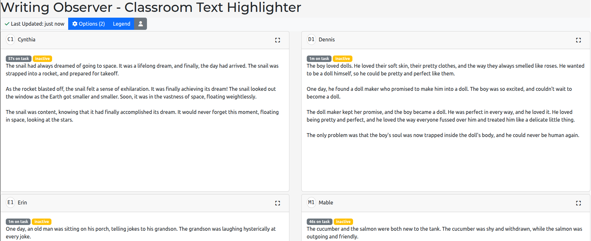
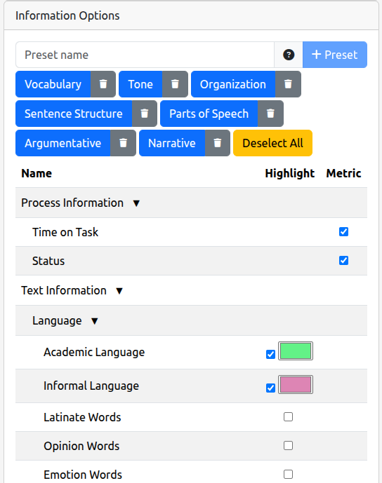
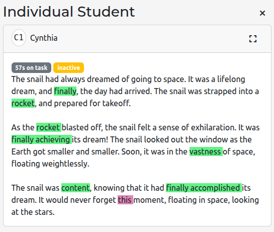

# Writing Observer - Classroom Text Highlighter

**Last updated:** September 30th, 2025

The Classroom Text Highlighter dashboard visualizes student writing with rich NLP-driven annotations. Use it to help students notice patterns in their drafts, guide whole-class discussions, or plan targeted mini-lessons based on the language skills your learners are using.

> **Who is this for?** Teachers who want to explore student writing through highlights, time-on-task metrics, and reusable annotation presets.

## What you can do with this dashboard

* **Display student writing at a glance.** See every student's document in a responsive grid, with quick navigation between document sources.
* **Highlight key language features.** Turn on NLP indicators (parts of speech, sentence structures, tone, etc.) and instantly spot trends across the class.
* **Track writing behaviors.** Add process metrics such as time on task or status badges so you know who is still working versus finished.
* **Save and reuse presets.** Build highlight collections (e.g., "Argumentative Evidence" or "Narrative Voice") and recall them with one click.
* **Surface a legend for students.** Share the color key so learners understand what each highlight represents during conferences or gallery walks.
* **Zoom into individual students.** Expand any tile for a focused view, ideal for projecting on screen or printing annotated drafts.

## Getting started

1. **Open the dashboard.** From the primary dashboard, select **Classroom Text Highlighter**. The dashboard loads at `/wo_classroom_text_highlighter/dash`.
2. **Confirm the connection.** The WebSocket indicator in the toolbar should be green. If not, check your login status via the profile sidebar.
3. **Pick a document source.** In **Settings → Document Source**, choose where essays should come from (e.g., most recent document, document accessed at specific time, etc). Adjust any source-specific options if prompted.
4. **Select NLP options.** In the **Information Options** table, check the highlights and metrics you want to display. Group headers (e.g., *Text Information*, *Process Information*) expand to reveal individual features.
5. **Adjust the layout.** Use the view controls to set students per row, tile height, and whether student names appear. These settings make it easy to adapt the dashboard for stations, projector mode, or screen readers.

## Working with highlights and presets

* **Legend button:** Shows the current highlight color key so you can share the meaning with students.
* **Presets panel:** Save combinations of options (e.g., "Sentence Structure") for future lessons. Name your preset, click **Add Preset**, and it stores the current configuration. Select a preset from the list to instantly apply it.
* **Deselect All preset:** Quickly clears every highlight and metric selection if you want to start fresh.
* **Custom colors:** Customize colors for each selected highlightable item.

## Exploring student writing

* **Student tiles:** Each tile shows badges for selected metrics (time on task, status) followed by the highlighted text. Tiles resize automatically based on your layout settings.
* **Expand view:** Click the expand icon to open the **Individual Student** drawer. This view removes the grid so you can focus on one student, scroll without distractions, and discuss highlights during conferences.
* **Loading feedback:** A progress bar appears while new highlights are generated. The banner updates with counts so you know when all documents are ready.

## Tips for classroom use

* Begin mini-lessons by projecting the legend and a few anonymized tiles. Have students identify how the highlights connect to the day's learning target.
* Combine process metrics with highlights to spot students who spent little time on task but still produced strong structures—perfect for peer coaching pairs.
* Encourage student self-assessment by sharing individual tiles and asking learners to explain why certain phrases received highlights.

## Troubleshooting

* **No students appear.** Ensure the URL contains a `course_id` and that the selected document source has submissions. Try toggling the Options panel to refresh the selection.
* **Highlights don't change after I toggle options.** Wait for the loading banner to disappear; the dashboard batches NLP requests and updates tiles when processing finishes.
* **Colors are confusing.** Use the legend button to review the palette, or save a preset with fewer simultaneous highlights.
* **Error alert shows up.** Read the message for guidance. The dashboard records error details (visible to developers) that you can share with your support contact.

With the Classroom Text Highlighter, you can transform raw student writing into an interactive, data-informed experience that keeps learners engaged and reflective.
